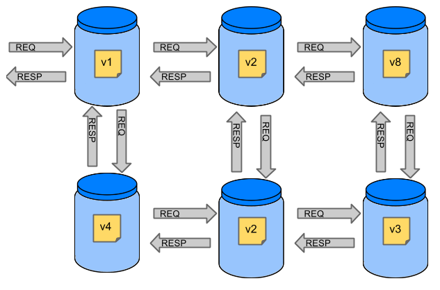
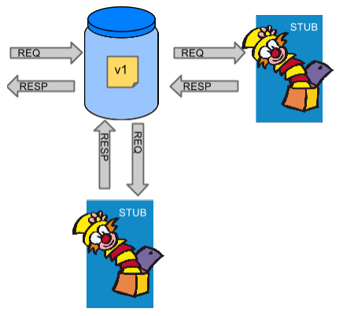
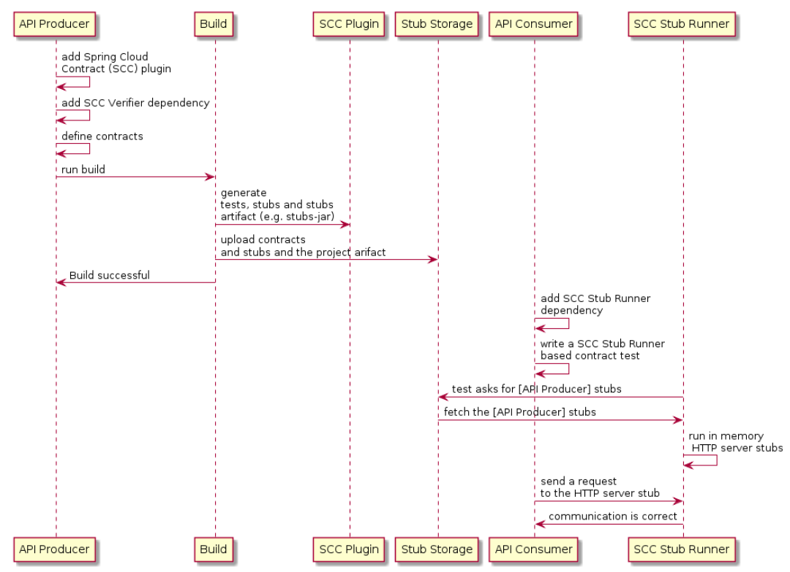

# Spring Cloud Contract 使用手册

## 简介

Spring Cloud Contract将测试驱动开发(Test-Driven Development, TDD)提升到了软件架构级别，可以使我们实施消费者驱动(consumer-driven)和服务提供者驱动(producer-driven)契约测试。

### 为什么需要Spring Cloud Contract

假设有一个系统由多个微服务构成，如下图所示：



如果我们要对上图中最左上角的应用进行测试，有两种选择：部署所有的微服务，进行端到端的测试；在单元和集成测试中Mock其他微服务。这两种方法各有优缺点。

#### 部署所有的微服务并进行端到端的测试

优点：

* 模拟了生产环境
* 测试了服务之间的真是情况

缺点：

* 为了测试一个微服务，需要部署所有与之关联的微服务、数据库及其他项目等
* 测试该微服务的环境不能同时进行其他的测试
* 需要较长的时间
* 测试结果的反馈需要一个较长的时间
* 难以调试

#### 在单元和集成测试中Mock其他微服务

优点：

* 提供快速的反馈
* 没有其他基础设施的要求

缺点：

* 服务创建的stubs可能与真实情况没有关系
* 通过了所有测试，但在生产环境可能还是失败

Spring Cloud Contract就是为了解决前面的问题出现的。它的主要思想是在不需要部署所有的微服务的前提下，能够快速给出反馈。使用了它的stubs，测试微服务所需要的只是该服务直接使用的那些应用，如下图所示：



Spring Cloud Contract能保证测试微服务时所使用的stubs是由该服务所调用的服务创建的，并且他们已经通过了服务提供方的测试。

Spring Cloud Contract的主要目标是：

* 保证HTTP和Messaging stubs的表现和服务端的表现是一致的
* 提升ATDD (acceptance test-driven development)方法和微服务架构风格
* 提供一种使契约的变化立刻体现在服务提供与消费方的方式
* 自动生成服务端的测试代码

### 什么是契约

在微服务中，服务的消费方应该清晰的定义出期望得到的结果，而且应该以一种格式化的方式表达出来，这就是契约出现的原因。契约就是服务的提供与消费双方关于API或消息通信方式的一种约定。假设你希望向服务方发出一个带有客户公司ID和希望贷款的数量的请求，通过`/fraudcheck`URL和`PUT`方法，服务方会给出是否为欺诈的结果。服务方需要给出一个这样的契约：

```yaml
request: # (1)
  method: PUT # (2)
  url: /yamlfraudcheck # (3)
    body: # (4)
      "client.id": 1234567890
      loanAmount: 99999
    headers: # (5)
      Content-Type: application/json
    matchers:
      body:
        - path: $.['client.id'] # (6)
          type: by_regex
          value: "[0-9]{10}"
response: # (7)
  status: 200 # (8)
  body: # (9)
    fraudCheckStatus: "FRAUD"
    "rejection.reason": "Amount too high"
  headers: # (10)
    Content-Type: application/json
# 作为消费者，在集成测试中发起一个请求时：
#
# (1) - 如果消费者发起一个请求
# (2) - 使用‘PUT’方法
# (3) - 请求路径是"/yamlfraudcheck"
# (4) - 使用的是JSON格式的body
# * 有一个字段 `client.id`
# * 有一个字段 `loanAmount` 且值为 `99999`
# (5) - 信息头中 `Content-Type` 值为 `application/json`
# (6) - 并且 `client.id` 的值为正则表达式 `[0-9]{10}`
# (7) - 响应的结果是
# (8) - 状态码为 `200`
# (9) - JSON body是
#  { "fraudCheckStatus": "FRAUD", "rejectionReason": "Amount too high" }
# (10) - 头信息 `Content-Type` 等于 `application/json`
#
# 在服务提供方，自动生成测试：
#
# (1) - 请求被发送至消费提供方：
# (2) - 使用的是'PUT'方法
# (3) - URL地址是 "/yamlfraudcheck"
# (4) - JSON格式的body
# * 字段 `client.id` 值为 `1234567890`
# * 字段 `loanAmount` 值为 `99999`
# (5) - 头信息 `Content-Type` 等于 `application/json`
# (7) - 测试会通过，如果响应信息是：
# (8) - 状态码 `200`
# (9) - JSON body是
#  { "fraudCheckStatus": "FRAUD", "rejectionReason": "Amount too high" }
# (10) - 头信息 `Content-Type` 等于 `application/json`
```

## 快速开始

Spring Cloud Contract要设计到至少两个应用：服务提供方与服务消费方。

下面的UML图描述了Spring Cloud Contract中各部分的关系。



### 服务提供方

在服务提供方的应用中提供以下的依赖：

```xml
<dependency>
  <groupId>org.springframework.cloud</groupId>
  <artifactId>spring-cloud-starter-contract-verifier</artifactId>
  <scope>test</scope>
</dependency>
```

还需要在项目的`pom`文件中添加Spring Cloud Contract相关的构建插件：

```xml
<plugin>
  <groupId>org.springframework.cloud</groupId>
  <artifactId>spring-cloud-contract-maven-plugin</artifactId>
  <version>${spring-cloud-contract.version}</version>
  <extensions>true</extensions>
</plugin>
```

接下来需要在项目中添加所需要的契约文件，一般该文件位于`$rootDir/src/test/resources/contracts`目录下，文件名不一定要求是`contract.yml`、`contract.yaml`、`contracts.yml`、`contracts.yaml`等。

对于HTTP stubs，一个契约需要定义的内容有请求（包含HTTP方法、URLs、headers、状态码等）与响应。例如：

```yaml
request:
  method: PUT
  url: /fraudcheck
  body:
    "client.id": 1234567890
    loanAmount: 99999
  headers:
    Content-Type: application/json
  matchers:
    body:
      - path: $.['client.id']
        type: by_regex
        value: "[0-9]{10}"
response:
  status: 200
  body:
    fraudCheckStatus: "FRAUD"
    "rejection.reason": "Amount too high"
  headers:
    Content-Type: application/json;charset=UTF-8
```

运行`./mvnw clean install`命令，会自动的生成测试代码来验证应用是否与契约保持一致。默认情况下，生成的测试代码位于`org.springframework.cloud.contract.verifier.tests.`包下。

默认的测试模式是HTTP契约下使用`MockMvc`，生成的代码类似于：

```java
@Test
public void validate_shouldMarkClientAsFraud() throws Exception {
    // given:
    MockMvcRequestSpecification request = given()
        .header("Content-Type", "application/vnd.fraud.v1+json")
        .body("{\"client.id\":\"1234567890\",\"loanAmount\":99999}");
    // when:
    ResponseOptions response = given().spec(request)
        .put("/fraudcheck");
    // then:
    assertThat(response.statusCode()).isEqualTo(200);
    assertThat(response.header("ContentType")).matches("application/vnd.fraud.v1.json.*");
    // and:
    DocumentContext parsedJson = JsonPath.parse(response.getBody().asString());
    assertThatJson(parsedJson).field("['fraudCheckStatus']").matches("[AZ]{5}");
    assertThatJson(parsedJson).field("['rejection.reason']").isEqualTo("Amount too high");
}
```

因为当前应用的功能还没有实现，所以测试无法通过。为了使得测试通过，需要实现能够实例契约中关于HTTP请求的功能，还需要在`pom`文件中配置基础测试类的路径等信息：

```yaml
<build>
  <plugins>
    <plugin>
      <groupId>org.springframework.cloud</groupId>
      <artifactId>spring-cloud-contract-maven-plugin</artifactId>
      <version>2.1.2.RELEASE</version>
      <extensions>true</extensions>
      <configuration>
        <baseClassForTests>com.example.contractTest.BaseTestClass</baseClassForTests> # 指定基础测试类
      </configuration>
    </plugin>
    <plugin>
      <groupId>org.springframework.boot</groupId>
      <artifactId>spring-boot-maven-plugin</artifactId>
    </plugin>
  </plugins>
</build>
```

一个最基本的基础测试类是这样的：

```java

package com.example.contractTest;
import org.junit.Before;
import io.restassured.module.mockmvc.RestAssuredMockMvc;
public class BaseTestClass {
    @Before
    public void setup() {
        RestAssuredMockMvc.standaloneSetup(new FraudController());
    }
}

```

### 服务消费方

Spring Cloud Contract的Stub Runner在集成测试中运行WireMock实例模拟真实的服务。

首先需要在消费者应用的`pom`文件中添加Spring Cloud Contract Stub Runner的依赖：

```xml
<dependency>
  <groupId>org.springframework.cloud</groupId>
  <artifactId>spring-cloud-starter-contract-stub-runner</artifactId>
  <scope>test</scope>
</dependency>
```

有两种方式从Maven仓库中获得由服务提供方生成的stubs：

* 拉取服务提供方的代码，添加契约，然后运行以下命令：
  ```shell
  cd local-http-server-repo
  ./mvnw clean install -DskipTests
  ```
* 从远程仓库中获取已经存在的服务提供方的服务stubs，这个需要在配置文件中添加：
```yaml
stubrunner:
  ids: 'com.example:http-server-dsl:+:stubs:8080'
  repositoryRoot: https://repo.spring.io/libs-snapshot
```

接下来就可以在测试上写上`@AutoConfigureStubRunner`，并在注解中提供Spring Cloud Contract Stub Runner的`group-id`和` artifact-id`，例如：

```java
@RunWith(SpringRunner.class)
@SpringBootTest(webEnvironment=WebEnvironment.NONE)
@AutoConfigureStubRunner(ids = {"com.example:http-server-dsl:+:stubs:6565"},
  stubsMode = StubRunnerProperties.StubsMode.LOCAL)
public class LoanApplicationServiceTests {
  ...
}
```

## 功能特性

### Contract DSL

Spring Cloud Contract支持用多种语言编写，支持的语言有：Groovy、YAML、Java、Kotlin。但我们推荐的方式是使用YAML，所以本手册的例子契约均是使用YAML编写。

Spring Cloud Contract也支持在同一个文件中定义多个契约，一个典型的契约定义如下：

```yaml
description: Some description
name: some name
priority: 8
ignored: true
request:
  url: /foo
  queryParameters:
    a: b
    b: c
  method: PUT
  headers:
    foo: bar
    fooReq: baz
  body:
    foo: bar
  matchers:
    body:
      - path: $.foo
      type: by_regex
      value: bar
    headers:
      - key: foo
      regex: bar
response:
  status: 200
  headers:
    foo2: bar
    foo3: foo33
    fooRes: baz
  body:
    foo2: bar
    foo3: baz
    nullValue: null
  matchers:
    body:
      - path: $.foo2
        type: by_regex
        value: bar
      - path: $.foo3
        type: by_command
        value: executeMe($it)
      - path: $.nullValue
        type: by_null
        value: null
    headers:
      - key: foo2
        regex: bar
      - key: foo3
        command: andMeToo($it)
```

在契约中，常见的顶层元素有：

* Description：在契约中可以添加一段文本作为该契约的描述
* Name：
* Ignoring Contracts
* Contracts in Progress
* Passing Values from Files


## 常见问题

### 最佳实践

### FAQs
